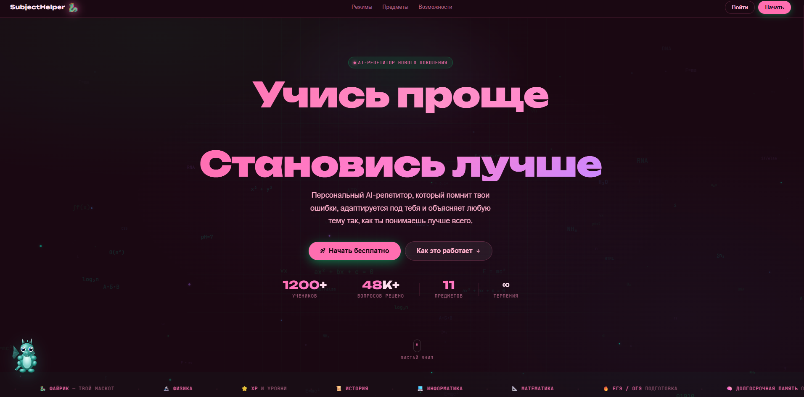
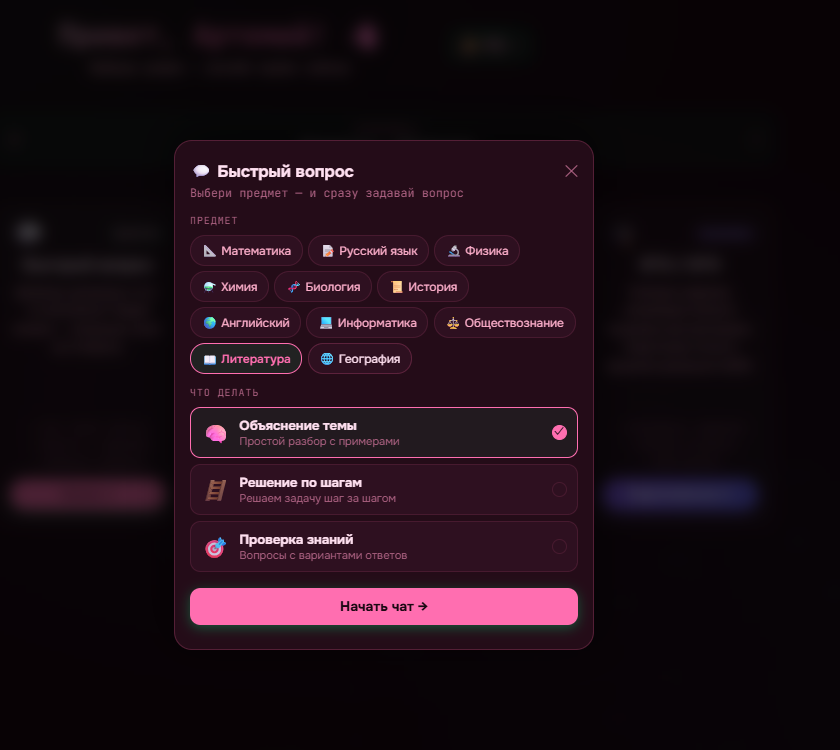
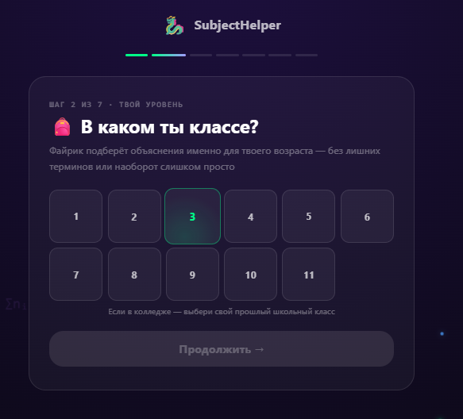
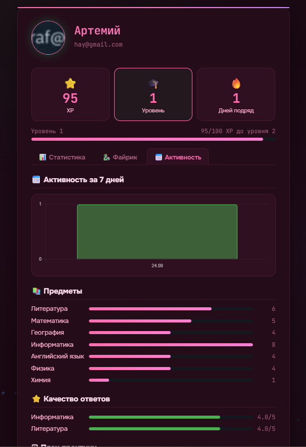
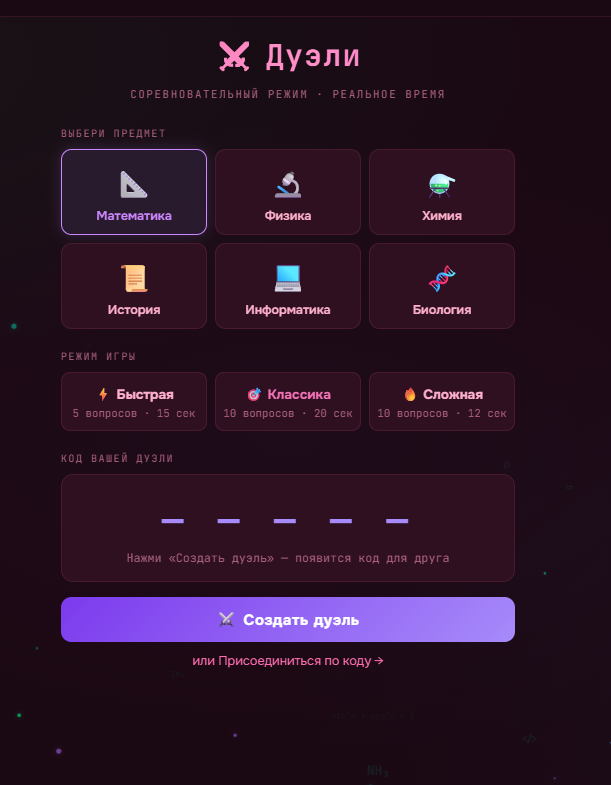

# SubjectHelper  
**Система автоматизированного репетиторства на базе больших языковых моделей**

**Веб-приложение-персональный ИИ-репетитор для школьников 5–11 классов**  
Математика • Физика • Русский язык • История • и любой другой школьный предмет

---

## 🚀 Главная фича

Представь: у тебя есть **личный репетитор 24/7**, который:
- Знает тебя лучше, чем любой учитель после первого урока  
- Помнит все твои ошибки и автоматически повторяет слабые темы  
- Подстраивается под твой стиль обучения и любимые предметы  
- Делает так, чтобы ты **хотел** заниматься каждый день  

SubjectHelper — это **первая система в мире**, которая объединяет:
- Полноценный LLM-диалог  
- Долгосрочную память SM-2  
- Глубокую 7-параметрическую персонализацию  
- Реальные дуэли с друзьями  
- Полную геймификацию (XP, стрик, Файрик)

---

## ✨ Ключевые особенности

| Функция                    | Что делает SubjectHelper                                      | Уровень крутости |
|---------------------------|---------------------------------------------------------------|------------------|
| **LLM-диалог**             | Реальный разговор с Llama-3.3-70b (Groq)                      | 🔥               |
| **Долгосрочная память**    | Алгоритм SM-2 + WeakTopic + MemoryNote                        | 🔥🔥             |
| **7-параметрическая персонализация** | Имя, класс, интересы, стиль обучения, цель, слабые темы     | 🔥🔥🔥           |
| **Дуэли в реальном времени** | WebSocket, генерация вопросов под уровень каждого            | 🔥🔥🔥🔥         |
| **Геймификация**           | XP, стрик, магазин скинов, маскот Файрик                       | 🔥🔥🔥🔥🔥       |
| **Контроль достоверности** | Параметризованные промпты + quiz + анализ ошибок              | 🔥🔥🔥🔥🔥🔥     |

---

## 🛠 Стек технологий (2026)

- **Backend**: Python + Flask + SQLAlchemy + SQLite  
- **LLM**: Groq (Llama-3.3-70b, 128K токенов)  
- **Реал-тайм**: SocketIO + WebSocket  
- **Геймификация**: Jinja2 + JavaScript (Fairik.js)  
- **База данных**: SQLite (легко мигрируется на PostgreSQL)

---

## 🎯 Что уже работает (MVP)

- Полная система регистрации и авторизации  
- Онбординг (7 параметров)  
- Чат с мгновенной персонализацией  
- Алгоритм SM-2 с автоматическими повторениями  
- 4 режима: «Быстрый вопрос», «Интенсив», «Роадмап», «Экзамены»  
- Профиль ученика: уровень, стрик, XP, маскот Файрик  
- Полностью параметризованные промпты под любой предмет и класс

---

## 📸 Примеры интерфейса

### 1. Главная страница

### 2. Окно чата (с персонализацией)

### 3. Онбординг (7 шагов)

### 4. Профиль ученика

### 5. Дуэли (в разработке)

---

## 🔥 Новизна проекта

**SubjectHelper — единственная система в России и мире**, которая одновременно имеет:

- Полноценный LLM-диалог  
- Долгосрочную память SM-2  
- Глубокую 7-параметрическую персонализацию  
- Реальные дуэли между учениками  
- Полноценную геймификацию  

Ни у Duolingo, ни у Khan Academy, ни у ChatGPT такого нет.

---

## 📈 Перспективы развития (2026–2027)

1. Дообучение модели на российских учебниках Минпросвещения (Qwen2.5 + RAG)  
2. Прокторинг экзаменов (Visibility API)  
3. Социальный модуль: друзья, группы, чаты  
4. Мобильные версии + панель для учителей и родителей  
5. Мультимодальность (фото + голос)  
6. Мини-игра с Файриком и мини-олимпиады  
7. Полноценное внедрение в школы РФ

---

## 💡 Почему SubjectHelper — это будущее образования

Потому что традиционные репетиторы стоят от 2–5 тысяч рублей в час.  
A SubjectHelper — **бесплатно**, **всегда доступно** и **лично твоя**.

---

## 👤 Автор

**Артемий Герега**  

2026

---

**Готов к вопросам!** 🚀
